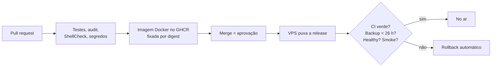

# MyFoodLink · engenharia de um SaaS multi-tenant para restaurantes

[](https://github.com/joaoluan/myfoodlink-engineering/actions/workflows/ci.yml)


O **MyFoodLink** é a plataforma que eu construí e opero para restaurantes: atendimento por WhatsApp com transferência para humano, CRM, campanhas com consentimento (LGPD), cardápio digital, pedidos, reservas, avaliações e fidelidade. Cada restaurante roda isolado, com processo, banco e instância de WhatsApp próprios. Hoje atende 2 restaurantes em produção, com cerca de 300 pedidos e mais de 2.000 acessos por mês.

O código do produto é privado. **Este repositório mostra como ele é feito:** problemas reais que apareceram em produção, a causa de cada um e a correção, com código e testes que rodam aqui. Tudo foi extraído do código real e sanitizado (sem clientes, endereços ou segredos).

> Antes do código, foram 15 anos em restaurantes, entre gestão e vendas. Por isso este repositório fala tanto de "o que acontece com o cliente" quanto de "o que acontece no servidor".

## Problemas reais e como foram resolvidos

| # | Problema | Área | Solução |
|---|---|---|---|
| 01 | [Cliente recebendo a mesma resposta duas vezes](docs/casos/01-mensagens-duplicadas.md) | Webhooks | Deduplicação por ID e HTTP 200 sempre ao provedor |
| 02 | ["Cancelar" virando descadastro de marketing](docs/casos/02-cancelar-virando-descadastro.md) | LGPD, produto | Opt-out por contexto, preservando o descadastro na dúvida |
| 03 | [Webhook de pagamento de outro restaurante derrubando o endpoint](docs/casos/03-webhook-de-pagamento-de-outro-restaurante.md) | Pagamentos, multi-tenant | Ignorar evento de conta desconhecida; um gateway por restaurante |
| 04 | [O cardápio que travava para sempre](docs/casos/04-deadlock-de-pool-no-postgres.md) | PostgreSQL, concorrência | Conexão da transação passada adiante e prazos no pool |
| 05 | [Redis que desistia de reconectar depois de um deploy](docs/casos/05-redis-que-desistia.md) | Resiliência | Limite de tentativas só no boot |
| 06 | [O mesmo cliente duplicado no CRM](docs/casos/06-um-telefone-um-contato.md) | Dados | Telefone brasileiro canônico e chave única por contato |
| 07 | [Backup diário perdido por disputa de lock](docs/casos/07-backup-perdido-por-disputa-de-lock.md) | Operação, incidente | Backup espera o lock; coleta de métricas pode pular |
| 08 | [Deploy que se protege sozinho](docs/casos/08-deploy-que-se-protege.md) | CI/CD | Deploy puxado com portões e rollback automático |
| 09 | [Provisionar um restaurante sem deixar nada pela metade](docs/casos/09-restaurante-pela-metade.md) | Multi-tenant | Preflight, confirmação, rollback só do que foi criado |
| 10 | [O risco de um subdomínio servir o restaurante errado](docs/casos/10-subdominio-servindo-outro-cliente.md) | Proxy, isolamento | Reload do proxy e validação do tenant no pós-deploy |

## CI/CD em uma imagem



Detalhes em [`docs/ci-cd.md`](docs/ci-cd.md). Arquitetura e decisões em [`docs/arquitetura.md`](docs/arquitetura.md).

## Stack do produto

**Backend:** Node.js, Express, PostgreSQL, Redis, Evolution API (WhatsApp), Stripe e Mercado Pago
**Frontend:** Next.js, React, TypeScript, Tailwind, monorepo com Turborepo
**Operação:** Docker, GitHub Actions, GHCR, Nginx, Cloudflare, Tailscale, WAL-G, Prometheus, Grafana, Loki, cofre de segredos
**Qualidade:** Node Test Runner, Vitest, Playwright, testes de regressão dos scripts de operação

## Rodando este repositório

Requer Node.js 20 ou superior, `bash` e `flock` (Linux). Sem dependências externas.

```sh
npm test               # testes de todos os casos
npm run lint:shell     # ShellCheck nos scripts de operação (requer shellcheck)
```

```
src/
  webhook/        casos 01 e 02 (admissão do webhook, deduplicação)
  consent/        caso 02 (descadastro por contexto)
  payments/       caso 03 (webhook Connect multi-tenant)
  db/             caso 04 (redes de segurança do pool)
  redis/          caso 05 (estratégia de reconexão)
  phone/          caso 06 (telefone brasileiro canônico)
  provisioning/   caso 09 (preparação de restaurante com rollback)
  security/       cifra de credenciais (AES-256-GCM) e link assinado (HMAC)
ops/              casos 07 e 08 (backup com lock, deploy puxado, gate de digest)
test/             um arquivo de teste por caso
docs/             arquitetura, CI/CD e os casos
```

## Como trabalho com IA

Uso Claude Code e Codex como par de programação para ir mais rápido. A arquitetura, as decisões, a revisão de cada mudança e os testes que provam o comportamento são meus. Os casos acima são problemas que eu investiguei e decidi como resolver.

## Autor

**João Luan Mendonça Moura** · Desenvolvedor Full Stack · Novo Hamburgo, RS
[Portfólio](https://joaomoura.dev.br/) · [Currículo](https://joaomoura.dev.br/curriculo-joao-moura-pt.pdf) · [GitHub](https://github.com/joaoluan)

---

### In English

Engineering notes from **MyFoodLink**, a multi-tenant restaurant SaaS I built and run, serving 2 restaurants in production with about 300 orders and 2,000+ visits per month (WhatsApp service with human handoff, CRM, consent-aware campaigns, online menus, orders, bookings, reviews and loyalty). The product code is private. This repository shows real production problems, their root causes and the fixes, as sanitized, tested code: webhook idempotency, context-aware opt-out (LGPD), multi-tenant payment webhooks, a PostgreSQL pool deadlock, Redis reconnection, Brazilian phone normalization, a backup lock race, a pull-based deploy with automatic rollback, and safe tenant provisioning. CI runs the tests on Node 20 and 22, ShellCheck and a gitleaks secret scan.
