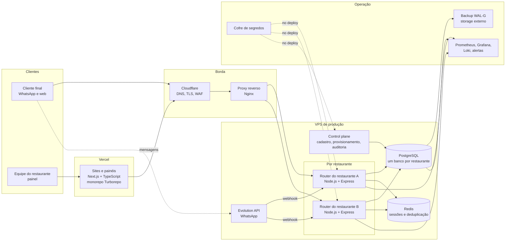

# Arquitetura do MyFoodLink (visão sanitizada)

O MyFoodLink é uma plataforma SaaS multi-tenant para restaurantes: atendimento por WhatsApp com transferência para humano, CRM, campanhas com consentimento, cardápio digital, pedidos, reservas, avaliações e fidelidade.

Endereços, nomes de servidores e credenciais foram omitidos.

## Decisões principais

| Decisão | Por quê |
|---|---|
| **Um processo, um banco e uma instância de WhatsApp por restaurante** | Isolamento: o bug ou a carga de um cliente não atinge outro, e é possível migrar, restaurar ou retirar um restaurante sozinho. |
| **Control plane separado**, acessível só por rede privada | Quem cria, suspende e audita restaurantes não fica exposto na internet. |
| **Frontends na Vercel, backend na VPS** | O site escala sozinho; o backend fica perto do banco e do WhatsApp. |
| **Produção não constrói, só executa** | Imagens Docker são construídas no CI, publicadas no GHCR e fixadas por digest. A VPS só puxa e roda. |
| **Segredos fora do repositório** | Cofre de segredos com acessos separados por ambiente; o CI falha se uma variável com nome de segredo aparecer em arquivo de configuração. |
| **Backup contínuo com recuperação ensaiada** | WAL-G com recuperação em ponto no tempo; o ensaio de restauração faz parte da rotina, não da teoria. |
| **Consentimento como regra de backend** | Opt-out global, limite de frequência, maioridade para bebida alcoólica e revalidação antes de cada envio de campanha. |

## Números do código (outubro de 2026)

| Repositório (privado) | Commits | Arquivos de teste |
|---|---|---|
| Router (atendimento, CRM, pedidos, reservas, campanhas) | 259 | 130 |
| Control plane (provisionamento e console da plataforma) | 60 | 17 |
| Infraestrutura (CD, backup, observabilidade, VPS) | 127 | 6 |

Além desses, o monorepo dos frontends (Next.js) e o site institucional.
