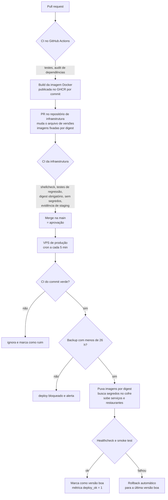

# CI/CD do MyFoodLink

## Visão geral

## Por etapa

**1. Repositórios de aplicação (router, control plane)**
- Todo PR roda os testes (`node --test`) e `npm audit --omit=dev --audit-level=high`.
- No merge, o CI constrói a imagem Docker e publica no GHCR com a tag do commit.
- Dependabot abre PRs de dependências; alertas de segurança viram PRs de correção.

**2. Repositório de infraestrutura**

O CI bloqueia o merge se:
- algum script de deploy ou backup tiver erro de sintaxe ou aviso do ShellCheck;
- os testes de regressão falharem (deploy, backup, retirada de restaurante, homologação);
- alguma imagem não estiver fixada por **digest**;
- uma imagem nova não tiver **evidência de staging** registrada;
- aparecer uma variável com nome de segredo em arquivo de configuração;
- o Docker Compose não validar.

**3. Produção (deploy puxado)**
- A aprovação é o merge. A VPS não recebe SSH de deploy nem guarda código-fonte.
- Portões: CI verde → backup recente → digest → healthcheck → smoke test.
- Falhou depois de aplicar: **rollback automático** para a última versão boa, e o commit é marcado como ruim.
- Toda rodada publica métricas, com alertas no Telegram.

**4. Este repositório**

O [workflow deste repositório](../.github/workflows/ci.yml) roda os testes em Node 20 e 22, ShellCheck nos scripts de operação e varredura de segredos com gitleaks em todo push e PR.

## Incidentes e correções no próprio pipeline

| Problema | Correção |
|---|---|
| Deploy pelo cron falhava sem o CLI do cofre no `PATH` e **não publicava a falha** | `PATH` explícito e métrica em toda rodada, inclusive sem release nova |
| Token fine-grained não lê check-runs | CI conferido pelos workflow runs do Actions |
| Restaurante com hífen no nome quebrava o healthcheck | Nome de contêiner padronizado com underscore |
| Backup diário pulado por disputa de lock com a coleta de métricas | [Caso 07](casos/07-backup-perdido-por-disputa-de-lock.md) |
| Ensaio de PITR podia usar uma base sem WAL arquivado suficiente | Validação da base e do WAL antes do ensaio |
| Alerta de RPO disparando com o banco ocioso | Métrica de WAL pendente: banco parado não é falha de backup |
